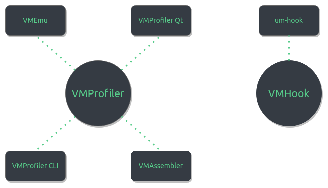
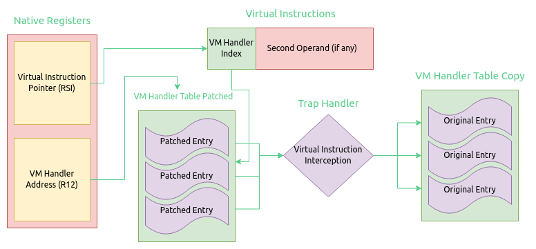
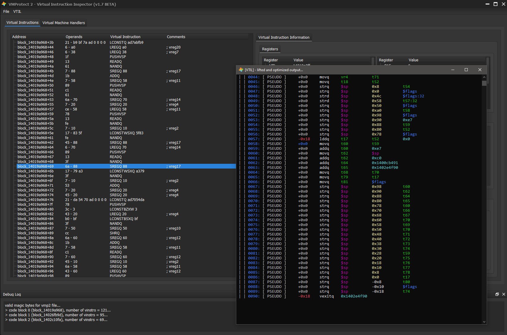
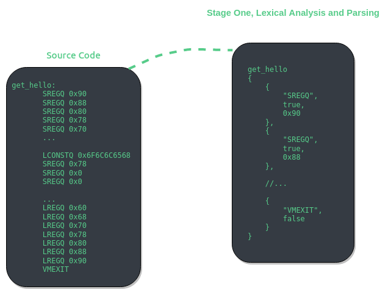
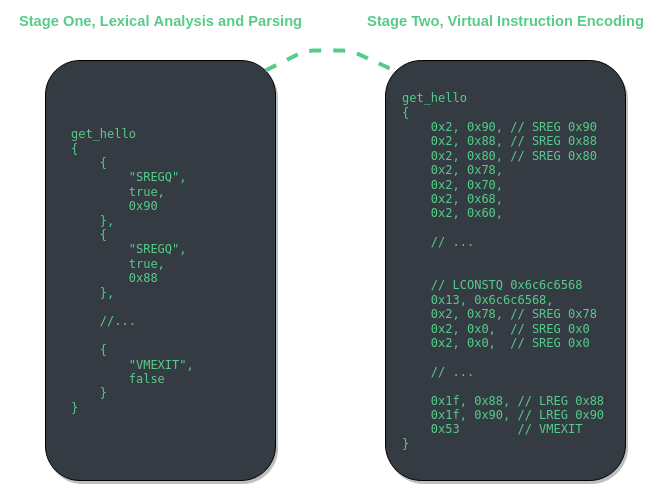
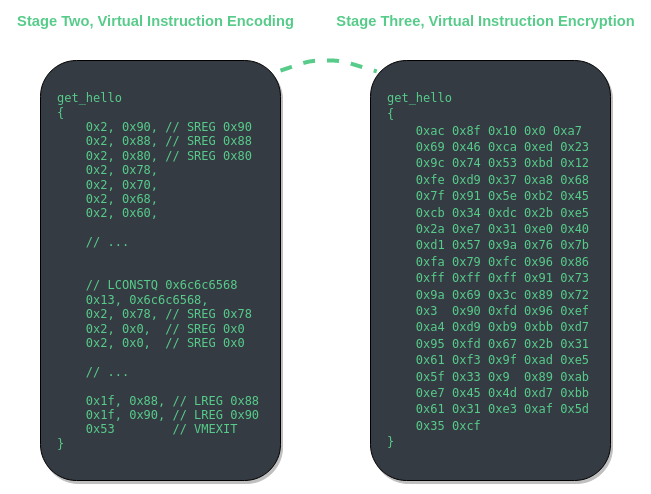
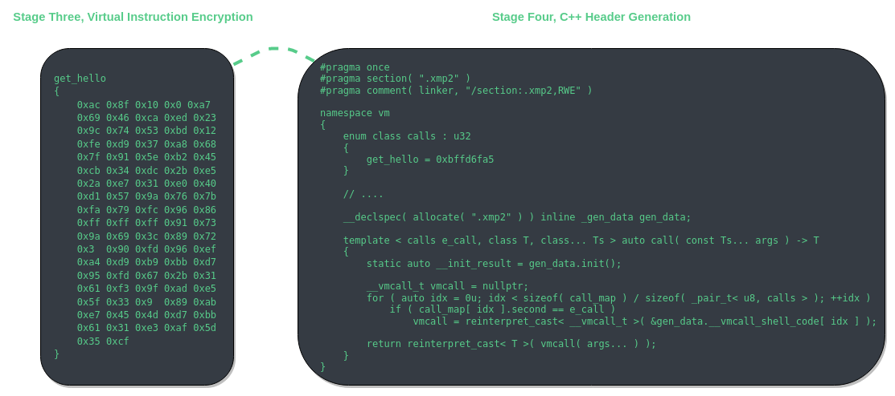

VMProtect 2 Project’s Group: [githacks.org/vmp2](https://githacks.org/vmp2)


# Purpose

The purpose of this article is to expound upon the prior work disclosed in the last article titled [“VMProtect 2 - Detailed Analysis of the Virtual Machine Architecture”](https://back.engineering/17/05/2021/), as well as correct a few mistakes. In addition, this post will focus primarily on the creation of static analysis tools using the knowledge disclosed in the prior post, and providing some detailed, albut unofficial, [VTIL](https://github.com/vtil-project/VTIL-Core) documentation. This article will also showcase all projects on [githacks.org/vmp2](https://githacks.org/vmp2), however, these projects are subject to change.

# Intentions

My intentions behind this research is to further my knowledge in the subject of software protection via native code virtualization, and code obfuscation, it is not to profit nor slander the name of VMProtect. Rather, the creator(s) of said software are to be respected as their work is clearly impressive and has arguably stood the test of time.

# Definitions

`Code Block`: A virtual instruction block, or code block, is a sequence of virtual instructions which are contained between virtual branching instructions. An example of this would be any instructions following a JMP instruction and the next JMP or VMEXIT instruction. A code block is represented in C++ as a structure ([vm::instrs::code_block_t](https://docs.back.engineering/vmprofiler/structvm_1_1instrs_1_1code__block__t.html)) containing a vector of virtual instructions, along with the beginning address of the code block contained in the structure itself. Other metadata about a given code block is also contained inside of this structure such as if the code block branches to two other code blocks, branches to only one code block, or exits the virtual machine.

`VMProtect 2 IL`: Intermediate level of representation, or language. Consider the encoded and encrypted virtual instructions to be the usable, native form of virtual instructions. Then IL would be a higher level representation, typically IL representation refers to a representation of code used by compilers and assemblers. An example of VMProtect 2 IL is what VMAssembler does lexical analysis on, or a file containing the IL to be more specific.

# VMProtect 2 - Project’s Overview



Note: you can find the [doxygen for VMProfiler here](https://docs.back.engineering/vmprofiler/)

Although there may seem to be quite a handful of projects located at [githacks.org/vmp2](https://githacks.org/vmp2), there is really only a single large library project and smaller projects which inherit this library. [VMProfiler](https://githacks.org/vmp2/vmprofiler) is the base library for [VMProfiler Qt](https://githacks.org/vmp2/vmprofiler-qt), [VMProfiler CLI](https://githacks.org/vmp2/vmprofiler-cli), [VMEmu](https://githacks.org/vmp2/vmemu), and [VMAssembler](https://githacks.org/vmp2/vmassembler). Each of these projects are static analysis based and thus [VMHook](https://githacks.org/vmp2/vmhook) and [um-hook](https://githacks.org/vmp2/um-hook) do not inherit [VMProfiler](https://githacks.org/vmp2/vmprofiler).

# VMHook - Overview 
 



[VMHook](https://githacks.org/vmp2/vmhook) is a very small C++ framework for hooking into VMProtect 2 virtual machines, um-hook inherits this framework and provides a demonstration of how to use the framework. [VMHook](https://githacks.org/vmp2/vmhook) is not used to uncover virtual instructions and their functionality, rather to alter them.

## VMHook - Example, um-hook 
 

```
.data
	__mbase dq 0h
	public __mbase

.code
__lconstbzx proc
	mov al, [rsi]
	lea rsi, [rsi+1]
	xor al, bl
	dec al
	ror al, 1
	neg al
	xor bl, al

	pushfq			; save flags...
	cmp ax, 01Ch
	je swap_val

					; the constant is not 0x1C
	popfq			; restore flags...	 
	sub rbp, 2
	mov [rbp], ax
	mov rax, __mbase
	add rax, 059FEh	; calc jmp rva is 0x59FE...
	jmp rax

swap_val:			; the constant is 0x1C
	popfq			; restore flags...
	mov ax, 5		; bit 5 is VMX in ECX after CPUID...
	sub rbp, 2
	mov [rbp], ax
	mov rax, __mbase
	add rax, 059FEh	; calc jmp rva is 0x59FE...
	jmp rax
__lconstbzx endp
end


```

um-hook is a project which inherits VMHook, it demonstrates [hooking the LCONSTBZX virtual instruction](https://githacks.org/vmp2/um-hook/-/blob/fbb3a7d0ebc54337cdacdb59f78bacf634783702/src/um-hook/lconstbzx.asm) and spoofing its immediate value. This subsequently affects the later virtual shift functions result, which ultimately results in the virtual routine returning true instead of false.

# VMProfiler - Overview 
 

[VMProfiler](https://githacks.org/vmp2/vmprofiler) is a C++ library which is used for static analysis of VMProtect 2 binaries. This is the base project for [VMProfiler Qt](https://githacks.org/vmp2/vmprofiler-qt), [VMProfiler CLI](https://githacks.org/vmp2/vmprofiler-cli), [VMEmu](https://githacks.org/vmp2/vmemu), and [VMAssembler](https://githacks.org/vmp2/vmassembler). [VMProfiler](https://githacks.org/vmp2/vmprofiler) also inherits [VTIL](https://github.com/vtil-project/VTIL-Core) and contains virtual machine handler profiles and lifters.

## VMProfiler - Virtual Machine Handler Profiling 
 

Virtual machine handlers are found and categorized via a pattern matching algorithm. [The first iteration of this algorithm](https://githacks.org/vmp2/vmprofiler/-/blob/cd8b79f28ba7e43d323cf6ad48596979dc57b881/include/vmprofiler.hpp#L23) simply compared the native instructions bytes. However this has proven to be ineffective as changes to the native instruction which don’t result in a different outcome but do change the native instructions bytes will cause the algorithm to miscatagorize or even fail to recongnize virtual machine handlers. Consider the following instruction variants, all of which when executed have the same result but each has their own unique sequence of bytes.

```
0:  36 48 8b 00             mov    rax,QWORD PTR ss:[rax]
4:  48 8b 00                mov    rax,QWORD PTR [rax] 
0:  36 48 8b 04 05 00 00    mov    rax,QWORD PTR ss:[rax*1+0x0]
7:  00 00 


```

In order to handle such cases, a [new iteration of the profiling algorithm](https://githacks.org/vmp2/vmprofiler/-/blob/ebfc4f421e029af1b276c4caef47bee4c710ec3f/src/vmprofiles) has been designed and implemented. This new rendition still pattern matches, however for each instruction of a virtual machine handler a lambda is defined. This lambda takes in a [ZydisDecodedInstruction](https://zyantific.com/doc/zydis/struct_zydis_decoded_instruction__.html) parameter, by reference, and returns a boolean. The result being true if a given decoded instruction meets all of the comparison cases. The usage of [zydis](https://github.com/zyantific/zydis) for this purpose allows for one to compare operands at a much finer level. For example, operand two from both instructions in the figure above is of type `ZYDIS_OPERAND_TYPE_MEMORY`. In addition, the base of this memory operand for both instructions is `RAX`. The mnemonic of both instructions is the same. This sort of minimalist comparison thinking is what this rendition of the profiling algorithm is based off of.

```
vm::handler::profile_t readq = {
    // MOV RAX, [RAX]
    // MOV [RBP], RAX
    "READQ",
    READQ,
    NULL,
    { { // MOV RAX, [RAX]
        []( const zydis_decoded_instr_t &instr ) -> bool {
            return instr.mnemonic == ZYDIS_MNEMONIC_MOV &&
                   instr.operands[ 0 ].type == ZYDIS_OPERAND_TYPE_REGISTER &&
                   instr.operands[ 0 ].reg.value == ZYDIS_REGISTER_RAX &&
                   instr.operands[ 1 ].type == ZYDIS_OPERAND_TYPE_MEMORY &&
                   instr.operands[ 1 ].mem.base == ZYDIS_REGISTER_RAX;
        },
        // MOV [RBP], RAX
        []( const zydis_decoded_instr_t &instr ) -> bool {
            return instr.mnemonic == ZYDIS_MNEMONIC_MOV && 
            	   instr.operands[ 0 ].type == ZYDIS_OPERAND_TYPE_MEMORY &&
                   instr.operands[ 0 ].mem.base == ZYDIS_REGISTER_RBP &&
                   instr.operands[ 1 ].type == ZYDIS_OPERAND_TYPE_REGISTER &&
                   instr.operands[ 1 ].reg.value == ZYDIS_REGISTER_RAX;
        } } } };


```

In the figure above, the [READQ](https://back.engineering/17/05/2021/#READQ) profile is displayed. Notice that not every single instruction for a virtual machine handler must have a zydis lambda for it. Only enough for a unique profile to be constructed for it. There are in fact additional native instructions for [READQ](https://back.engineering/17/05/2021/#READQ) which are not accounted for with zydis comparison lambdas.

## VMProfiler - Virtual Branch Detection Algorithm 
 

The most glaring consistency in a virtual branch is the usage of [PUSHVSP](https://back.engineering/17/05/2021/#PUSHVSP). This virtual instruction is executed when two encrypted values are on the stack at `VSP + 0`, and `VSP + 8`. These encrypted values are decrypted using the last [LCONSTDW](https://back.engineering/17/05/2021/#LCONSTDW) value of a given block. Thus a trivially small algorithm can be created based upon these two consistencies. The first part of the algorithm will simply use `std::find_if` with reverse iterators to locate the last [LCONSTDW](https://back.engineering/17/05/2021/#LCONSTDW) in a given code block. This DWORD value will be interpreted as the XOR key used to decrypt the encrypted relative virtual addresses of both branches. A second `std::find_if` is now executed to locate a [PUSHVSP](https://back.engineering/17/05/2021/#PUSHVSP) virtual instruction that when executed, two encrypted relative virtual addresses will be located on the stack. The algorithm will interpret the top two stack values of every [PUSHVSP](https://back.engineering/17/05/2021/#PUSHVSP) instruction as encrypted relative virtual addresses and apply an XOR operation with the last [LCONSTDW](https://back.engineering/17/05/2021/#LCONSTDW) value.

```
std::optional< jcc_data > get_jcc_data( vm::ctx_t &vmctx, code_block_t &code_block )
{
    // there is no branch for this as this is a vmexit...
    if ( code_block.vinstrs.back().mnemonic_t == vm::handler::VMEXIT )
        return {};

    // find the last LCONSTDW... the imm value is the JMP xor decrypt key...
    // we loop backwards here (using rbegin and rend)...
    auto result = std::find_if( code_block.vinstrs.rbegin(), code_block.vinstrs.rend(),
                                []( const vm::instrs::virt_instr_t &vinstr ) -> bool {
                                    auto profile = vm::handler::get_profile( vinstr.mnemonic_t );
                                    return profile && profile->mnemonic == vm::handler::LCONSTDW;
                                } );

    jcc_data jcc;
    const auto xor_key = static_cast< std::uint32_t >( result->operand.imm.u );
    const auto &last_trace = code_block.vinstrs.back().trace_data;

    // since result is already a variable and is a reverse itr
    // i'm going to be using rbegin and rend here again...
    //
    // look for PUSHVSP virtual instructions with two encrypted virtual
    // instruction rva's ontop of the virtual stack...
    result = std::find_if(
        code_block.vinstrs.rbegin(), code_block.vinstrs.rend(),
        [ & ]( const vm::instrs::virt_instr_t &vinstr ) -> bool {
            if ( auto profile = vm::handler::get_profile( vinstr.mnemonic_t );
                 profile && profile->mnemonic == vm::handler::PUSHVSP )
            {
                const auto possible_block_1 = code_block_addr( vmctx, 
                		vinstr.trace_data.vsp.qword[ 0 ] ^ xor_key ),
                           possible_block_2 = code_block_addr( vmctx, 
                        vinstr.trace_data.vsp.qword[ 1 ] ^ xor_key );

                // if this returns too many false positives we might have to get
                // our hands dirty and look into trying to emulate each branch
                // to see if the first instruction is an SREGQ...
                return possible_block_1 > vmctx.module_base &&
                       possible_block_1 < vmctx.module_base + vmctx.image_size &&
                       possible_block_2 > vmctx.module_base &&
                       possible_block_2 < vmctx.module_base + vmctx.image_size;
            }
            return false;
        } );

    // if there are not two branches...
    if ( result == code_block.vinstrs.rend() )
    {
        jcc.block_addr[ 0 ] = code_block_addr( vmctx, last_trace );
        jcc.has_jcc = false;
        jcc.type = jcc_type::absolute;
    }
    // else there are two branches...
    else
    {
        jcc.block_addr[ 0 ] = code_block_addr( vmctx, 
        	result->trace_data.vsp.qword[ 0 ] ^ xor_key );
        jcc.block_addr[ 1 ] = code_block_addr( vmctx, 
        	result->trace_data.vsp.qword[ 1 ] ^ xor_key );

        jcc.has_jcc = true;
        jcc.type = jcc_type::branching;
    }

    return jcc;
}


```

Note: the underlying flag in which the virtual branch is dependent on is not extracted using this algorithm. This is one of the negative aspects of this algorithm as it stands.

# VMProfiler Qt - Overview 
 



[VMProfiler Qt](https://githacks.org/vmp2/vmprofiler-qt) is a small C++ Qt based GUI that allows for inspection of virtual instruction traces. These traces are generated via [VMEmu](https://githacks.org/vmp2/vmemu) and contain all information for every virtual instruction. The GUI contains a window for virtual register values, native register values, the virtual stack, virtual instructions, expandable virtual branches, and lastly a tab containing all virtual machine handlers and their native instructions, and transformations.

# VMProfiler CLI - Overview 
 

[VMProfiler CLI](https://githacks.org/vmp2/vmprofiler-cli) is a command line project which is used to demonstrate all VMProfiler features. This project only consists of a single file ([main.cpp](https://githacks.org/vmp2/vmprofiler-cli/-/blob/93b14609ed8a0ca72fa9a0ac3bd2589703780135/src/main.cpp)), however it’s a good reference for those who are interested in inheriting VMProfiler as their code base.

```
Usage: vmprofiler-cli [options...]
Options:
    --bin, --vmpbin        unpacked binary protected with VMProtect 2
    --vmentry, --entry     rva to push prior to a vm_entry
    --showhandlers         show all vm handlers...
    --showhandler          show a specific vm handler given its index...
    --vmp2file             path to .vmp2 file...
    --showblockinstrs      show the virtual instructions of a specific code block...
    --showallblocks        shows all information for all code blocks...
    --devirt               lift to VTIL IR and apply optimizations, then display the output...
    -h, --help             Shows this page


```

# VMEmu - Overview 
 

[VMEmu](https://githacks.org/vmp2/vmemu) is a [unicorn-engine](https://github.com/unicorn-engine/unicorn) based project which emulates virtual machine handlers to subsequently decrypt virtual instruction operands. [VMEmu](https://githacks.org/vmp2/vmemu) inherits [VMProfiler](https://githacks.org/vmp2/vmprofiler) which aids in determining if a given code block has a virtual JCC in it. [VMEmu](https://githacks.org/vmp2/vmemu) does not currently support dumped modules as “dumped modules” can take many forms. There is not one standard file format for a dumped module so support for dumped modules will come with another [unicorn-engine](https://github.com/unicorn-engine/unicorn) based project to produce a standard dump format.

```
Usage: vmemu [options...]
Options:
    --vmentry              relative virtual address to a vm entry... (Required)
    --vmpbin               path to unpacked virtualized binary... (Required)
    --out                  output file name for trace file... (Required)
    -h, --help             Shows this page


```

## VMEmu - Unicorn Engine, Static Decryption Of Opcodes 
 

In order to statically decrypt virtual instruction operands, one must first understand how these operands are encrypted in the first place. The algorithm VMProtect 2 uses to encrypt virtual instruction operands can be represented as a mathematical formula.

[](assets/formula.png)

Considering the above figure, decryption of operands is merely the inverse of function F. This inverse is generated into native x86_64 instructions and embedded into each virtual machine handler as well as calc_jmp. One could simply emulate these instructions via reimplementation of them in C/C++, however my implementation of such instructions is merely for the purpose of encryption, not decryption. Instead, the usage of [unicorn-engine](https://github.com/unicorn-engine/unicorn) is preferred in this situation as by simply emulating these virtual machine handlers, decrypted operands will be produced.

Understand that no runtime value can possibly affect the decryption of operands, thus invalid memory accesses can be ignored. However, runtime values can alter which virtual instruction blocks are decrypted, thus the need for saving the context of the emulated CPU prior to execution of a branching virtual instruction. This will allow for restoring the state of the emulated CPU prior to the branching instruction, but additionally altering which branch the emulated CPU will take, allowing for complete decryption of all virtual instruction blocks statically.

To reiterate, the usage of unicorn-engine is for computing F(e,o) and G(e,o) where e takes the form of the native register RBX, o takes the form of the native register RAX, and Tm,Fn​​ takes the form of transformation mth.

In addition, not only can decrypted operands be obtained using unicorn-engine, but views of the virtual stack can be snapshotted for every single virtual instruction. This allows for algorithms to take advantage of values that are on the stack. Calls to native WinAPI’s are done outside of the virtual machine, except for rare cases such as the VMProtect 2 packer virtual machine handler which calls `LoadLibrary` with a pointer to the string “NTDLL.DLL” in `RCX`.

## VMEmu - Virtual Branching 
 

Seeing all code paths is extremely important. Consider the most basic situation where a parameter is checked to see if it’s a nullptr.

```
auto demo(int* a)
{
    if (!a)
        return {};

    // more code down here
}


```

Analysis of the above code without being able to see all code paths would result in something useless. Thus seeing all branches inside of the virtual machine was the top priority. In this section I will detail how virtual branching works inside of the VMProtect 2 virtual machine, as well as the algorithms I’ve designed to recognize and analyze all paths.

To begin, not all code blocks end with a branching virtual instruction. Some end with virtual machine exit’s, or absolute jumps. Thus the need for an algorithm which can determine if a given virtual instruction block will branch or not. In order to produce such an algorithm, intimate knowledge of the virtual machine branching mechanism is required, specifically how [native JCC’s](https://www.felixcloutier.com/x86/jcc) are translated to virtual instructions.

Consider the possible affected flag bits of the [native ADD](https://www.felixcloutier.com/x86/add) instruction. Flags `OF`, `SF`, `ZF`, `AF`, `CF`, and `PF` can all be affected depending on the computation. Native branching is done via [JCC instructions](https://www.felixcloutier.com/x86/jcc) which depend upon the state of a specific flag or flags.

```
test rax, rax
jz branch_1


```

Figure 2.

Consider figure 2, understand that the `JZ` native instruction will jump to “branch_1” if the `ZF` flag is set. One could reimplement figure 2 in such a way that only the [native JMP](https://www.felixcloutier.com/x86/jmp) instruction and a few other math and stack operations could be used. Reducing the number of branching instructions to a single [native JMP](https://www.felixcloutier.com/x86/jmp) instruction.

Consider that the [native TEST](https://www.felixcloutier.com/x86/test) instruction performs a bitwise `AND` on both operands, sets flags accordingly, and disregards the `AND` result. One could simply replace the [native TEST](https://www.felixcloutier.com/x86/test) instruction with a few stack operations and the [native AND](https://www.felixcloutier.com/x86/and) instruction.

```
0:  50                      push   rax
1:  48 21 c0                and    rax,rax
4:  9c                      pushf
5:  48 83 24 24 40          and    QWORD PTR [rsp],0x40
a:  48 c1 2c 24 03          shr    QWORD PTR [rsp],0x3
f:  58                      pop    rax
10: ff 34 25 00 00 00 00    push   branch_1
17: ff 34 25 00 00 00 00    push   branch_2
1e: 48 8b 04 04             mov    rax,QWORD PTR [rsp+rax*1]
22: 48 83 c4 10             add    rsp,0x10
26: 48 89 44 24 f8          mov    QWORD PTR [rsp-0x8],rax
2b: 58                      pop    rax
2c: ff 64 24 f0             jmp    QWORD PTR [rsp-0x10]


```

Figure 3. Note: bittest/test is not used here as it is implemented via AND, and SHR.

Although it may seem that converting a single instruction into multiple may be counterproductive and requiring more work in the end, this is not the case as these instructions will be reused in other orientations. Reimplementation of all JCC instructions could be done quite simply using the above assembly code template. Even such branching instructions as the `JRCXZ`, `JECXZ`, and `JCXZ` instructions could be implemented by simply swapping `RAX` with `RCX`/`EAX`/`CX` in the above example.

Figure 3, although in native x86_64, provides a solid example of how VMProtect 2 does branching inside of the virtual machine. However, VMProtect 2 adds additional obfuscation via math obfuscation. Firstly, both addresses pushed onto the stack are encrypted relative virtual addresses. These addresses are decrypted via XOR. Although XOR, SUB, and other math operations themselves are obfuscated into NAND operations.

```
; push encrypted relative virtual addresses onto the stack...
LCONSTQ 0x19edc194
LCONSTQ 0x19ed8382
PUSHVSP

; calculate which branch will be executed, then read its encrypted address on the stack...
LCONSTBZXW 0x3
LCONSTBSXQ 0xbf
LREGQ 0x80
NANDQ
SREGQ 0x68
SHRQ
SREGQ 0x70
ADDQ
SREGQ 0x48
READQ

; clear the stack of encrypted addresses...
SREGQ 0x68
SREGQ 0x70
SREGQ 0x90

; put the selected branch encrypted address back onto the stack...
LREGQ 0x68
LREGQ 0x68

; xor value on top of the stack with 59f6cb36
LCONSTDW 0xa60934c9
NANDDW
SREGQ 0x48
LCONSTDW 0x59f6cb36
LREGDW 0x68
NANDDW
SREGQ 0x48
NANDDW
SREGQ 0x90
SREGQ 0x70

; removed virtual instructions...
; …

; load the decrypted relative virtual address and jmp...
LREGQ 0x70
JMP


```

Figure 4.

As discussed prior, VMProtect 2 uses the XOR operation to decrypt and subsequently encrypt the relative virtual addresses pushed onto the stack. Selection of a specific encrypted relative virtual address is done by shifting a given flag to result in its value being either zero or eight. Then, adding `VSP` to the resulting shift computes the address in which the encrypted relative virtual address is located.

```
#define FIRST_CONSTANT a60934c9
#define SECOND_CONSTANT 59f6cb36

unsigned int jcc_decrypt(unsigned int encrypted_rva)
{
    unsigned int result = ~encrypted_rva & ~encrypted_rva;
    result = ~result & ~FIRST_CONSTANT;
    result = ~(~encrypted_rva & ~SECOND_CONSTANT) & ~result;
    return result;
}


```

Figure 5. Note: Notice that `FIRST_CONSTANT` and `SECOND_CONSTANT` are inverses of each other.

# VMAssembler - Overview 
 

[VMAssembler](https://githacks.org/vmp2/vmassembler) is a virtual instruction assembler project originally contemplated as a joke. Regardless of its significance to anything, it is a fun project that allows for an individual to become more acquainted with the features of VMProtect 2. [VMAssembler](https://githacks.org/vmp2/vmassembler) uses [LEX](https://en.wikipedia.org/wiki/Lex_(software)) and [YACC](https://en.wikipedia.org/wiki/Yacc) to parse text files for labels and virtual instruction tokens. It then encodes and encrypts these virtual instructions based upon the specific virtual machine specified via the command line. Finally a C++ header file is generated which contains the assembled virtual instructions as well as the original VMProtect’ed binary.

## VMAssembler - Assembler Stages 
 


[VMAssembler](https://githacks.org/vmp2/vmassembler) uses [LEX](https://en.wikipedia.org/wiki/Lex_(software)) and [YACC](https://en.wikipedia.org/wiki/Yacc) to parse text files for virtual instruction names and immediate values. There are four main stages to VMAssembler, lexical analysis and parsing, virtual instruction encoding, virtual instruction encryption, and lastly C++ code generation.

## VMAssembler - Stage One, Lexical Analysis and Parsing 
 



Lexical analysis and token parsing are two stages themselves, however I will be referring to these stages as one as the result of these is data structures manageable by C++.

The first stage of VMAssembler is almost entirely handled by [LEX](https://en.wikipedia.org/wiki/Lex_(software)) and [YACC](https://en.wikipedia.org/wiki/Yacc). Text is converted into C++ structures representing virtual instructions. These structures are referred to as [_vinstr_meta](https://docs.back.engineering/vmassembler/struct__vinstr__meta.html) and [_vlable_meta](https://docs.back.engineering/vmassembler/struct__vlabel__meta.html). These structures are then used by stage two to validate virtual instructions existence, as well as encoding these higher level representations of virtual instructions into decrypted virtual operands.

## VMAssembler - Stage Two, Virtual Instruction Encoding 
 



Virtual instruction encoding stage of assembling also validates the existence of all virtual instructions for each virtual label. This is done by comparing profiled vm handler names with the virtual instruction name token. If a virtual instruction does not exist then assembling will cease.

```
if ( !parse_t::get_instance()->for_each( [ & ]( _vlabel_meta *label_data ) -> bool {
         std::printf( "> checking label %s for invalid instructions... number of instructions = %d\n",
                      label_data->label_name.c_str(), label_data->vinstrs.size() );

         const auto result = std::find_if(
             label_data->vinstrs.begin(), label_data->vinstrs.end(),
             [ & ]( const _vinstr_meta &vinstr ) -> bool {
                 std::printf( "> vinstr name = %s, has imm = %d, imm = 0x%p\n", vinstr.name.c_str(),
                              vinstr.has_imm, vinstr.imm );

                 for ( auto &vm_handler : vmctx->vm_handlers )
                     if ( vm_handler.profile && vm_handler.profile->name == vinstr.name )
                         return false;

                 std::printf( "[!] this vm protected file does not have the vm handler for: %s...\n",
                              vinstr.name.c_str() );

                 return true;
             } );

         return result == label_data->vinstrs.end();
     } ) )
{
    std::printf( "[!] binary does not have the required vm handlers...\n" );
    exit( -1 );
}


```

Once all virtual instruction IL is validated, encoding of these virtual instructions can commence. The order in which the virtual instruction pointer advances is important to note throughout the process of encoding and encrypting. The direction dictates the ordering of operands and virtual instructions.

## VMAssembler - Stage Three, Virtual Instruction Encryption 
 



Just like stage two of assembly, stage three must also take into consideration which way the virtual instruction pointer advances. This is because operands must be encrypted in an order based upon the direction of VIP’s advancement. The encryption key produced by the last operands encryption is used for the starting encryption key for the next as detailed in [“VMEmu - Unicorn Engine, Static Decryption Of Opcodes” 

This stage will do F−1(e,o) and G−1(e,o) for each virtual instruction operand of each label. Lastly, the relative virtual address from vm_entry to the first operand of the first virtual instruction is calculated and then encrypted using the inverse transformations used to decrypt the relative virtual address to the virtual instructions themselves. You can find more details about these transformations inside of the [vm_entry section of the last article](https://back.engineering/17/05/2021/#vm_entry).

## VMAssembler - Stage Four, C++ Header Generation 
 


Stage four is the final stage of virtual instruction assembly. In this stage C++ code is generated. The code is completely self contained and environment agnostic. However, there are a few limitations to the current implementation. Most glaring is the need for a RWX (read, write, and executable) section. If one were to use this generated C++ code in a Windows kernel driver then the driver would not support HVCI systems. Also, as of 6/19/2021, MSVC cannot compile the generated header as for whatever reason, the static initializer for the raw module causes the compiler to hang. You must use clang-cl if you want to compile with the generated header file from VMAssembler.

## VMAssembler - Example 
 

Once a C++ header has been generated using [VMAssembler](https://githacks.org/vmp2/vmassembler) you can now include it into your project and compile using any compiler that is not MSVC as the MSVC compiler for some reason cannot handle such a large static initializer which the protected binary is contained in, clang-cl handles it however. Each label that you define will be inserted into the `vm::calls` enum. The value for each enum entry is the encrypted relative virtual address to the virtual instructions of the label.

```
namespace vm
{
	enum class calls : u32
	{
		get_hello = 0xbffd6fa5,
		get_world = 0xbffd6f49,
	};
	
	//
	// ...
	//
	
    template < calls e_call, class T, class... Ts > auto call( const Ts... args ) -> T
    {
        static auto __init_result = gen_data.init();

        __vmcall_t vmcall = nullptr;
        for ( auto idx = 0u; idx < sizeof( call_map ) / sizeof( _pair_t< u8, calls > ); ++idx )
            if ( call_map[ idx ].second == e_call )
                vmcall = reinterpret_cast< __vmcall_t >( &gen_data.__vmcall_shell_code[ idx ] );

        return reinterpret_cast< T >( vmcall( args... ) );
    }
}


```

You can now call any label from your C++ code by simply specifying the `vm::calls` enum entry and the labels return type as templated params.

```
#include <iostream>
#include "test.hpp"

int main()
{
	const auto hello = vm::call< vm::calls::get_hello, vm::u64 >();
    const auto world = vm::call< vm::calls::get_world, vm::u64 >();
	std::printf( "> %s %s\n", ( char * )&hello, (char*)&world );
}


```

Output

```
> hello world


```
 
# VTIL - Getting Started

[The VTIL project](https://github.com/vtil-project/VTIL-Core) as it currently stands on github has some untold requirements and dependencies which are not submoduled. I have created a [fork of VTIL](https://githacks.org/_xeroxz/vtil/) which submodule’s keystone and capstone, as well as describes the Visual Studios configurations that must be applied to a project which inherits VTIL. VTIL uses C++ 2020 features such as the `concept` keyword, thus the latest Visual Studios (2019) must be used, vs2017 is not supported. If you are compiling on a non-windows/non-visual studios environment you can ignore the last sentence.

```
git clone --recursive https://githacks.org/_xeroxz/vtil.git


```

Note: maybe this will become a branch in VTIL-Core, if so, you should refer to the official VTIL-Core repository if/when that happens.

Another requirement to compile VTIL is that you must define the `NOMINMAX` macro prior to any inclusion of Windows.h as [std::numeric_limits](http://www.cplusplus.com/reference/limits/numeric_limits/) has static member functions (max, and min). These static member function names are treated as min/max macros and thus cause compilation errors.

```
#define NOMAXMIN
#include <Windows.h>


```

The last requirement has to do with dynamic initializers causing stack overflows. In order for your compiled executable containing VTIL to not crash instantly you must increase the initial stack size. I set mine to 4MB just for precaution as I have a large amount of dynamic initializers in VMProfiler.

```
Linker->System->Stack Reserve Size/Stack Commit Size, set both to 4194304


```

## VTIL - The Basic Block 
 

[vtil::optimizer::apply_all](https://githacks.org/_xeroxz/vtil/-/blob/0d2b89a429ce5f82a9d5fbb75b4b039203cc214b/VTIL-Compiler/common/apply_all.hpp#L133) operates on the [vtil::basic_block](https://githacks.org/_xeroxz/vtil/-/blob/0d2b89a429ce5f82a9d5fbb75b4b039203cc214b/VTIL-Architecture/routine/basic_block.hpp#L61) object which can be constructed by calling [vtil::basic_block::begin](https://githacks.org/_xeroxz/vtil/-/blob/0d2b89a429ce5f82a9d5fbb75b4b039203cc214b/VTIL-Architecture/routine/basic_block.hpp#L285). A [vtil::basic_block](https://githacks.org/_xeroxz/vtil/-/blob/0d2b89a429ce5f82a9d5fbb75b4b039203cc214b/VTIL-Architecture/routine/basic_block.hpp#L61) contains a list of VTIL instructions which ends with a branching instruction or a [vexit](https://docs.vtil.org/instruction-set/control-flow/vexit). To add a new basic block linking to existing basic block’s you can call [vtil::basic_block::fork](https://githacks.org/_xeroxz/vtil/-/blob/0d2b89a429ce5f82a9d5fbb75b4b039203cc214b/VTIL-Architecture/routine/basic_block.hpp#L290).

```
// Creates a new block connected to this block at the given vip, if already explored returns nullptr,
// should still be called if the caller knowns it is explored since this function creates the linkage.
//
basic_block* basic_block::fork( vip_t entry_vip )
{
    // Block cannot be forked before a branching instruction is hit.
    //
    fassert( is_complete() );

    // Caller must provide a valid virtual instruction pointer.
    //
    fassert( entry_vip != invalid_vip );

    // Invoke create block.
    //
    auto [blk, inserted] = owner->create_block( entry_vip, this );
    return inserted ? blk : nullptr;
}


```

Note: `vtil::basic_block::fork` will assert [is_complete](https://githacks.org/_xeroxz/vtil/-/blob/0d2b89a429ce5f82a9d5fbb75b4b039203cc214b/VTIL-Architecture/routine/basic_block.hpp#L331) so ensure that your basic blocks end with a branching instruction prior to forking.

Once a basic block has been created, one can start appending VTIL instructions documented at [https://docs.vtil.org/](https://docs.vtil.org/) to the basic block object. For every defined VTIL instruction a templated function is created using the “WRAP_LAZY” macro. You can now “emplace_back” any VTIL instruction with ease in your virtual machine handler lifters.

```
        // Generate lazy wrappers for every instruction.
        //
#define WRAP_LAZY(x)                                                     \
        template<typename... Tx>                                         \
        basic_block* x( Tx&&... operands )                               \
        {                                                                \
            emplace_back( &ins:: x, std::forward<Tx>( operands )... );   \
            return this;                                                 \
        }
        WRAP_LAZY( mov );    WRAP_LAZY( movsx );    WRAP_LAZY( str );    WRAP_LAZY( ldd );
        WRAP_LAZY( ifs );    WRAP_LAZY( neg );      WRAP_LAZY( add );    WRAP_LAZY( sub );
        WRAP_LAZY( div );    WRAP_LAZY( idiv );     WRAP_LAZY( mul );    WRAP_LAZY( imul );
        WRAP_LAZY( mulhi );  WRAP_LAZY( imulhi );   WRAP_LAZY( rem );    WRAP_LAZY( irem );
        WRAP_LAZY( popcnt ); WRAP_LAZY( bsf );      WRAP_LAZY( bsr );    WRAP_LAZY( bnot );   
        WRAP_LAZY( bshr );   WRAP_LAZY( bshl );     WRAP_LAZY( bxor );   WRAP_LAZY( bor );    
        WRAP_LAZY( band );   WRAP_LAZY( bror );     WRAP_LAZY( brol );   WRAP_LAZY( tg );     
        WRAP_LAZY( tge );    WRAP_LAZY( te );       WRAP_LAZY( tne );    WRAP_LAZY( tle );    
        WRAP_LAZY( tl );     WRAP_LAZY( tug );      WRAP_LAZY( tuge );   WRAP_LAZY( tule );   
        WRAP_LAZY( tul );    WRAP_LAZY( js );       WRAP_LAZY( jmp );    WRAP_LAZY( vexit );  
        WRAP_LAZY( vemit );  WRAP_LAZY( vxcall );   WRAP_LAZY( nop );    WRAP_LAZY( sfence );
        WRAP_LAZY( lfence ); WRAP_LAZY( vpinr );    WRAP_LAZY( vpinw );  WRAP_LAZY( vpinrm );   
        WRAP_LAZY( vpinwm );
#undef WRAP_LAZY


```

## VTIL - VMProfiler Lifting 
 

Take an example for the virtual machine handler lifter [LCONSTQ](https://back.engineering/17/05/2021/#LCONSTQ). The lifter simply adds a VTIL push instruction which pushes a 64bit value onto the stack. Note the usage of [vtil::operand](https://githacks.org/_xeroxz/vtil/-/blob/0d2b89a429ce5f82a9d5fbb75b4b039203cc214b/VTIL-Architecture/arch/operands.hpp#L40) to create a 64bit immediate value operand.

```
vm::lifters::lifter_t lconstq = {
    // push imm<N>
    vm::handler::LCONSTQ,
    []( vtil::basic_block *blk, vm::instrs::virt_instr_t *vinstr, vmp2::v3::code_block_t *code_blk ) {
        blk->push( vtil::operand( vinstr->operand.imm.u, 64 ) );
    } };


```

VMProfiler simply loops over all virtual instructions for a given block and applies lifters. Once all code blocks are exhausted, [vtil::optimizer::apply_all](https://githacks.org/_xeroxz/vtil/-/blob/0d2b89a429ce5f82a9d5fbb75b4b039203cc214b/VTIL-Compiler/common/apply_all.hpp#L133) is called. This is the climax of VTIL currently as some of these optimization passes are targeted toward stack machined based obfuscation. The purpose of submodeling VTIL in vmprofiler is for these optimizations as programming these myself would take months of research. Compiler optimization is a field of its own, interesting, but not something I have the time to pursue at the moment so VTIL will suffice.
 
# Conclusion - Final Words and Future Work

Although I have done much work on VMProtect 2, the main success of my endeavors has truly been statically uncovering all virtual branches and producing a legible IL. Additionally doing all of this in a, [well documented](https://docs.back.engineering/vmprofiler/), [open source](https://githacks.org/vmp2/vmprofiler), C++ library which can be inherited further by other researchers. I would not consider the work I’ve done anything close to a “finished product” or something that could be presented as such, it is merely a step in the right direction for devirtualization. The last word of the last sentence leads me to my next point.

Devirtualization has been avoided throughout all of my documentation and articles pertaining to my VMProtect 2 work as to me this is something that has always been out of the scope of the project. Considering I’m a lone researcher, there are many aspects to the virtual machine architecture which could not be tackled by a single individual in a meaningful amount of time. For example, when an instruction is not virtualized by VMProtect 2, a vmexit happens and the original instruction is executed outside of the virtual machine. This means if I wanted to see an ENTIRE routine it would require me to follow code execution back out of the virtual machine and thus VMEmu would need many more months of development to support such a thing. The way that I have programmed these projects allows for multiple engineers working on the code base at a given time, except there seems to be little to no interest in open source development of these tools, even with such detailed documentation everyone wants to “make their own solution”, which is understandable, but not productive in the long run.

Additionally, devirtualization requires converting back to native x86_64. In order to do this, every single virtual machine handler must be profiled, every single virtual machine handler must have a VTIL lifter defined for it, and every single VTIL instruction must be mapped to a native instruction. At least this is what seems to be required with the level of knowledge I currently have, there may well be a much more elegant way of going about this that I am simply oblivious to at this time. Thus my conclusion to devirtualization: it is not a job for a single person, thus the goal of my project(s) has never been devirtualization, it’s always been an IL view of the virtual instructions with VTIL providing deobfuscation pseudo code. The IL alone is enough for a dedicated individual to begin research, the VTIL pseudo code makes it easier for the rest of us. VMProfiler Qt combined with IDA Pro as it currently exists can be used to analyze binaries protected with VMProtect 2. It may not be a beginner friendly solution, but in my opinion, it will suffice.

I must note that it is not a far stretch of the mind to assume private entities have well rounded solutions for VMProtect 2. I can imagine what a team of individuals, much more skilled than myself, working on devirtualization day in and day out would produce. On top of this, considering the length of time VMProtect 2 has been public, there has been ample time for these private entities to create such tools.

## Conclusion - Future Work 
 

Lastly, during my research of VMProtect 2, there has been a subtle urge to reimplement some of the obfuscation and virtual machine features myself in an open source manner to better convey the features of VMProtect 2. However, after much thought, it would be more productive to create an obfuscation framework that would allow for these ideas to be created with relative ease. A framework that would handle code analysis as well as file format parsing, deconstruction, and reconstruction. Something that is lower level than an LLVM optimization pass, but high enough level that a programmer using this framework would only need to write the obfuscation algorithms themselves and would not have to even know the underlying file format. This framework would only support a single ISA, which would be x86. The details beyond this point are still being contemplated at: [https://githacks.org/llo/](https://githacks.org/llo/)